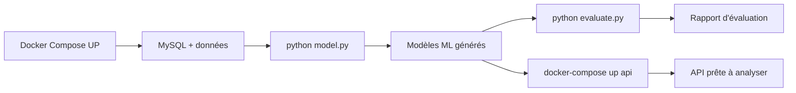

# SocialMetricsAI

Analyse de sentiment des tweets avec machine learning. Application qui prédit si un tweet est positif ou négatif en utilisant deux modèles de classification indépendants.

## Table des matières

- [Vue d'ensemble](#vue-densemble)
- [Architecture](#architecture)
- [Prérequis](#prérequis)
- [Installation et lancement](#installation-et-lancement)
- [Endpoints API](#endpoints-api)
- [Structure du projet](#structure-du-projet)

## Vue d'ensemble

**SocialMetricsAI** est une API Flask qui analyse le sentiment des tweets. Elle combine deux modèles de machine learning :
- **Modèle positif** : prédit la probabilité qu'un tweet soit positif
- **Modèle négatif** : prédit la probabilité qu'un tweet soit négatif

Le score final est calculé selon la formule : **Score = P(positive) - P(negative)**

## Architecture

L'application utilise une architecture conteneurisée avec 3 services :

```
┌─────────────────────────────────────────────────┐
│         Docker Compose Stack                    │
├─────────────────────────────────────────────────┤
│                                                 │
│  ├─ MySQL 8.0 (port 3306)                     │
│  │  └─ Database: socialmetrics_db              │
│  │                                             │
│  ├─ Flask API (port 5000)                     │
│  │  ├─ GET  /api/health                       │
│  │  └─ POST /api/analyze                      │
│  │                                             │
│  └─ phpMyAdmin (port 8080)                    │
│     └─ Interface web pour MySQL               │
│                                                 │
└─────────────────────────────────────────────────┘
```

### Services

| Service | Image | Port | Rôle |
|---------|-------|------|------|
| db | mysql:8.0 | 3306 | Base de données |
| api | Build local | 5000 | API Flask |
| phpmyadmin | phpmyadmin | 8080 | Interface DB web |

## Prérequis

- **Docker** (20.10+)
- **Docker Compose** (2.0+)
- **Python 3.8+** (si exécution locale sans Docker)

### Vérifier les prérequis :
```bash
docker --version
docker-compose --version
```

## Installation et lancement

### 1. Cloner/accéder au projet

```bash
git clone https://github.com/prash-lb/SocialMetricsAI.git
cd SocialMetricsAI
```

### 2. Lancer les services

```bash
docker-compose up -d
```

Cela démarre les 3 services en arrière-plan :
- MySQL sur `localhost:3306`
- API Flask sur `localhost:5000`
- phpMyAdmin sur `localhost:8080`

### 3. Arrêter les services

```bash
docker-compose down
```

Pour arrêter complètement et supprimer les volumes de données :
```bash
docker-compose down -v
```

## Entraînement et Évaluation des Modèles

### Avant de lancer l'API

L'API a besoin des modèles ML pré-entraînés pour fonctionner. Ces modèles sont générés par `model.py` en utilisant les données de la base de données MySQL.

### Prérequis

S'assurer que :
1. Docker Compose est lancé (`docker-compose up -d`)
2. MySQL est actif et contient des données dans la table `tweets`

### Étape 1 : Entraîner les modèles

Lance l'entraînement du vectoriseur TF-IDF et des deux modèles de régression logistique :

```bash
python src/model.py
```

**Résultat attendu :**
```
- Données chargées : 150 tweets trouvés pour l'entraînement.
- Entraînement du modèle de détection positive...
- Entraînement du modèle de détection négative...
- Étape 2 validée : Les modèles ont été entraînés et sauvegardés avec succès dans /models/ !
```

Les modèles sont sauvegardés dans le dossier `models/` :
- `vectorizer.pkl` : Vectoriseur TF-IDF
- `model_positive.pkl` : Modèle de classification positive
- `model_negative.pkl` : Modèle de classification négative

### Étape 2 : Évaluer les performances

Après l'entraînement, lance l'évaluation pour voir les métriques de performance sur un jeu de validation :

```bash
python src/evaluate.py
```

**Métriques affichées :**
- Classification Report : Precision, Recall, F1-Score
- Confusion Matrix : TP, FP, TN, FN
- Rapport distinct pour chaque modèle (positif et négatif)

**Exemple de sortie :**
```
 --- DÉBUT DE L'ÉVALUATION DU MODÈLE --- 

=== 1. PERFORMANCES DU MODÈLE POSITIF ===

📜 Rapport de Classification (Positif) :
              precision    recall  f1-score   support

           0       0.92      0.88      0.90        34
           1       0.85      0.90      0.87        26

=== 2. PERFORMANCES DU MODÈLE NÉGATIF ===
...
```

### Flux complet



## 🔌 Endpoints API

### Health Check
Vérifie que l'API et la base de données sont actives.

**Requête :**
```http
GET http://localhost:5000/api/health
```

**Réponse (succès - 200) :**
```json
{
  "status": "healthy",
  "database_connected": true,
  "message": "Connexion MySQL fonctionnelle depuis l'API Flask !"
}
```

**Réponse (erreur - 500) :**
```json
{
  "status": "unhealthy",
  "database_connected": false,
  "error": "Impossible de joindre la base de données MySQL."
}
```

### Analyse de Sentiment
Analyse une liste de tweets et retourne leur score de sentiment.

**Requête :**
```http
POST http://localhost:5000/api/analyze
Content-Type: application/json
```

**Format 1 : Tableau brut**
```json
[
  "J'adore cette application !",
  "Cela m'énerve beaucoup",
  "C'est plutôt neutre"
]
```

**Format 2 : Objet avec clé `tweets`**
```json
{
  "tweets": [
    "J'adore cette application !",
    "Cela m'énerve beaucoup"
  ]
}
```

**Réponse (succès - 200) :**
```json
{
  "J'adore cette application !": 0.8752,
  "Cela m'énerve beaucoup": -0.6234,
  "C'est plutôt neutre": 0.0142
}
```

**Erreurs possibles :**
- `400` : Format JSON invalide ou tableau vide
- `500` : Modèles non initialisés ou erreur de traitement

### Exemple avec cURL

```bash
# Health check
curl http://localhost:5000/api/health

# Analyse de tweets
curl -X POST http://localhost:5000/api/analyze \
  -H "Content-Type: application/json" \
  -d '["Excellent !", "Vraiment nul"]'
```

## Structure du projet

```
SocialMetricsAI/
├── src/
│   ├── app.py              # Application Flask principale
│   ├── database.py         # Connexion MySQL
│   ├── model.py            # Entraînement des modèles
│   └── __pycache__/        # Cache Python
├── models/                 # Artefacts du modèle (généré par model.py)
│   ├── vectorizer.pkl
│   ├── model_positive.pkl
│   └── model_negative.pkl
├── data/
│   └── schema.sql          # Schéma d'initialisation de la DB
├── dockerfile              # Configuration Docker pour l'API
├── docker-compose.yml      # Orchestration des services
├── requirements.txt        # Dépendances Python
└── README.md              # Documentation (ce fichier)
```

## 🔧 Configuration

### Variables d'environnement MySQL (docker-compose.yml)

```yaml
MYSQL_ROOT_PASSWORD: root_password
MYSQL_DATABASE: socialmetrics_db
MYSQL_USER: user_api
MYSQL_PASSWORD: api_password
```

### Accès phpMyAdmin

- **URL** : http://localhost:8080
- **Serveur** : `db`
- **Utilisateur** : `root`
- **Mot de passe** : `root_password`

## Flux de traitement

1. **Réception** : Tableau de tweets en JSON
2. **Vectorisation** : Conversion des textes en vecteurs numériques
3. **Prédiction** : Calcul des probabilités pour chaque modèle
4. **Score** : Différence P(positive) - P(negative)
5. **Retour** : Dictionnaire {tweet: score}
